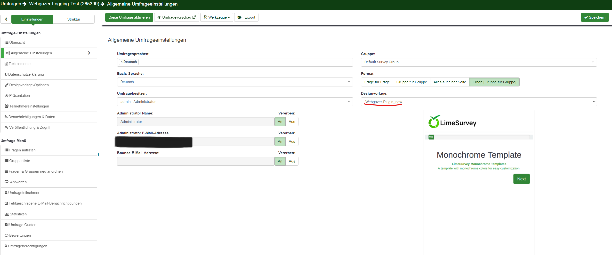
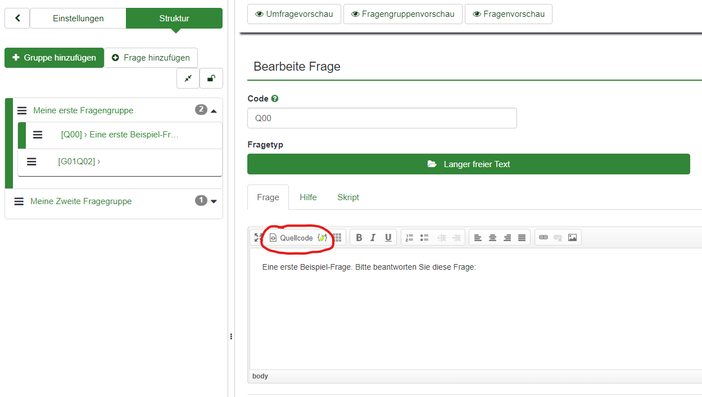

# 🌟 **LimeGazer** 

**LimeGazer** allows you to use Webcam-based eye-tracking in your LimeSurvey survey.

---

## 🚀 **Getting Started**

In this tutorial, you'll learn how to install and use the Webgazer LimeSurvey plugin. For more details, check out the [Webgazer.js API](https://webgazer.cs.brown.edu/#examples).

---

## 🛠️ **Installation**

To install the plugin, follow these steps:

1. **Admin Access Required**: Ensure you have an admin account.
2. **Navigate to Design Templates**: From the start page, head to Design Templates.
3. **Upload the Plugin**: Click "Upload and Install" and select the `.zip` file provided in this repository.
4. **Activate Template**: Open the General settings of your survey and choose the design template you've just uploaded.

You can now access the Webgazer API using the `webgazer` keyword for any question script area. 🎯



---

## ⚙️ **Usage**

1. **Edit a Question**: Choose a question from the question group where you want to use the Webgazer plugin.
2. **Insert Code**: Add this code once per question group.



3. **Insert the Following Script**:

```html
<script>
  var prediction = webgazer.getCurrentPrediction();
    if (prediction) {
        var x = prediction.x;
        var y = prediction.y;
    }
  webgazer.setGazeListener(function(data, elapsedTime) {
        var webgazerVideoContainer = document.getElementById('webgazerVideoContainer');
        webgazerVideoContainer.style.display = 'none';
        if (data == null) {
            return;
        }
        var xprediction = data.x; // these x coordinates are relative to the viewport
        var yprediction = data.y; // these y coordinates are relative to the viewport
        localStorage.setItem("GazePredictionX", xprediction);
        localStorage.setItem("GazePredictionY", yprediction);
    }).begin();
</script>
```

This script starts Webgazer and stores the prediction in the `localStorage`. This method allows other scripts in the same subgroup to access the data:

```
      var retrievedGazeX = localStorage.getItem("GazePredictionX");
      var retrievedGazeY = localStorage.getItem("GazePredictionY");
```
you can access the gaze data at any time.

---

## 📊 **Data Storage**

To store gaze data in CSV format and upload it to Firebase, use the following commands:

```javascript
// Create a Blob and upload to Firebase
const csvBlob = new Blob([csv], { type: 'text/csv;charset=utf-8;' });
const storageRef = firebase.storage().ref();
const fileRef = storageRef.child("Daytime/Path/" + filename);

fileRef.put(csvBlob)
  .then(function(snapshot) {
      console.log('CSV file uploaded to Firebase Storage successfully.');
  })
  .catch(function(error) {
      console.error('Error uploading CSV file to Firebase Storage:', error);
  });
```

---

## 📺 **Fullscreen Mode Detection**

You can also detect when the user enters or exits fullscreen mode:

```javascript
document.addEventListener('webkitfullscreenchange', fullscreenChange);
document.addEventListener('mozfullscreenchange', fullscreenChange);
document.addEventListener('fullscreenchange', fullscreenChange);
document.addEventListener('MSFullscreenChange', fullscreenChange);

function fullscreen() {
  // Check if fullscreen is available
  if (document.fullscreenEnabled || 
      document.webkitFullscreenEnabled || 
      document.mozFullScreenEnabled || 
      document.msFullscreenEnabled) {
      
      var iframe = document.querySelector('iframe');
      
      // Enter fullscreen
      if (iframe.requestFullscreen) {
          iframe.requestFullscreen();
      } else if (iframe.webkitRequestFullscreen) {
          iframe.webkitRequestFullscreen();
      } else if (iframe.mozRequestFullScreen) {
          iframe.mozRequestFullScreen();
      } else if (iframe.msRequestFullscreen) {
          iframe.msRequestFullscreen();
      }
  } else {
      document.querySelector('.error').innerHTML = 'Your browser is not supported';
  }
}

function fullscreenChange() {
    isFullscreen = !isFullscreen;
    if (!isFullscreen) {
        player.pause();
    }
}
```

---

## 📝 **Conclusion**

By following this guide, you can successfully integrate **Webgazer** eye-tracking technology into your LimeSurvey questions and leverage gaze data for advanced insights! 👁️💡

For more detailed documentation, feel free to explore the [Webgazer.js API](https://webgazer.cs.brown.edu/#examples).

